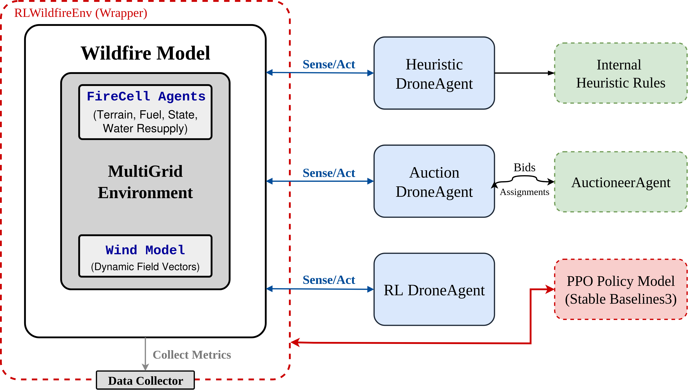

# Wildfire Drone Swarms Simulation (oulu-wildfire-drones)
[](https://opensource.org/licenses/MIT)
[](https://www.python.org/downloads/release/python-380/)


Agent-based simulation for comparative analysis of task allocation strategies in resource-constrained drone swarms for wildfire response. The environment couples a probabilistic Cellular Automata fire model with a spatial wind field and heterogeneous terrain and fuel loads. Drone agents operate under battery and water constraints and can resupply at lakes or urban stations. The framework records ANSI frames per step and includes a server-based replay viewer.

**Publication status.** The paper **“A Comparative Analysis of Task Allocation Strategies for Resource-Constrained Multi-Agent Drone Swarms in Wildfire Response”** was accepted at the **22nd International Conference on Networking, Sensing, and Control (ICNSC)**.


---

## Architecture



Components:
- **WildfireModel (Mesa)**: grid, CA fire dynamics, heterogeneous terrain (forest, grassland, urban, lake), wind field, resupply points, metrics, ANSI rendering.
- **Drone agents**:
  - `HeuristicDroneAgent`: nearest-fire-first with resource checks.
  - `AuctionDroneAgent` + `AuctioneerAgent`: centralized auction with wind/resupply-aware bids.
  - `RLDroneAgent`: 9 discrete actions (8-neighbour moves + stay), used in a PettingZoo `ParallelEnv`.
- **RL environment**: `RLWildfireEnv` (PettingZoo) with SB3 PPO wrappers via SuperSuit; optional VecNormalize; CPU-only by default.
- **Logging**: stepwise ANSI logs; optional export to self-contained HTML via `ansi2html`.

---

## Main capabilities

- **Environment**
  - CA fire spread on Moore neighbourhood; ignition uses base rate + wind alignment + terrain gain, attenuated by moisture.
  - Wind field: straight “jet” axis with lateral decay and per-cell jitter; optional per-step multiplicative gusts.
  - Terrain: forest / grassland (buffer around urban) / urban / lake. Urban cells optionally marked as water resupply.
- **Agents**
  - Discrete grid motion; collision avoidance for heuristic/auction; refilling on lakes (full) or urban resupply (+20).
  - Resource model: battery and water ∈ [0,100]. Extinguish costs 5 battery + 5 water.
- **Policies**
  - Heuristic baseline (local sensing, greedy target selection).
  - Auction (distance, battery/water penalties, fuel bonus, wind alignment, resupply distance).
  - RL (PPO, SB3): PettingZoo parallel wrapper, Discrete(9) actions, observation = flattened local window + global cues.
- **Metrics (recorded in summaries)**
  - Primary: `total_burnt_area` (natural burnouts), `time_to_containment`, `suppression_ratio_pct`.
  - Coordination/Energy: `workload_active_pct`, `workload_top30_share_pct`, `workload_gini`,
    `travel_steps_per_extinguish`, `ext_rate_per_step_per_drone_pct`,
    `energy_mean_final_batt_pct`, `energy_mean_depletion_pct`, etc.
- **Visual logs**
  - ANSI per-step frames (grid + wind panel) and agent status; optional `.html` conversion (inline CSS).

---

## Installation

```bash
python -m venv .venv
source .venv/bin/activate     # Windows: .venv\Scripts\activate
pip install -e .[dev]
pre-commit install            # optional
```

##  Citation
```
@inproceedings{vo2025droneswarms,
  title={A Comparative Analysis of Task Allocation Strategies for Resource-Constrained Multi-Agent Drone Swarms in Wildfire Response},
  author={Huan Vo, Constantino Álvarez Casado, Abhishek Kumar, Satu Tamminen, Petri Ihantola, Miguel Bordallo López, Le Nguyen},
  booktitle={2025 IEEE 2nd International Conference on Networking, Sensing, and Control (ICNSC) **(Accepted)**},
  year={2025},
  organization={IEEE}
}
```


## Authors and Acknowledgment
This project is developed by the Multimodal Sensing Lab (MMSLab) team of the Center for Machine Vision and Signal Analysis (CMVS) 
at the University of Oulu.
* **Authors**: Huan Vo, Constantino Álvarez Casado, Abhishek Kumar, Satu Tamminen, Petri Ihantola, Miguel Bordallo López, Le Nguyen
* **Code authors.** Huan Vo, Constantino Álvarez Casado, Le Nguyen
* **Contact Information**: 
  * For general questions, contact the team leader: miguel.bordallo [at] oulu.fi
  * For code-related issues and technical questions, contact: constantino.alvarezcasado [at] oulu.fi

We acknowledge the contributions of everyone involved in this project and appreciate any further contributions or feedback from the community.

## License
This project is licensed under the MIT License - see the LICENSE.md file for details.
